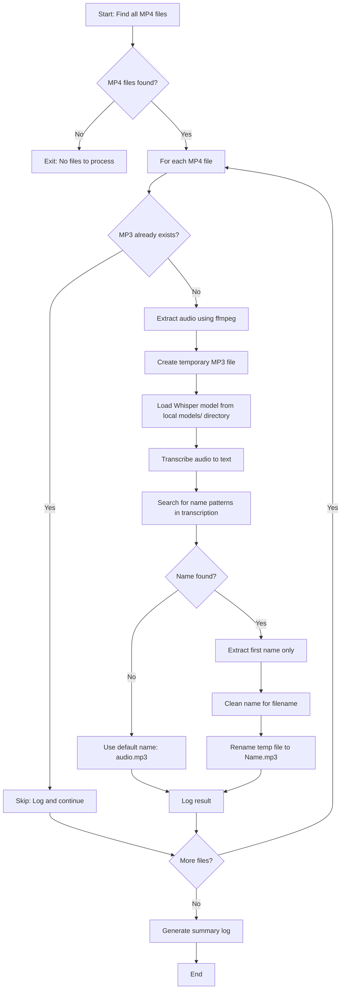

# Audio Extractor with Name-Based Naming

This Python script extracts audio from an MP4 video file and automatically names the resulting MP3 file based on the first person's name mentioned in the video introduction.


## Features

- Extracts audio from MP4 videos to MP3 format
- Transcribes audio using OpenAI Whisper
- Automatically detects the first person's name from introduction patterns
- Names the output MP3 file based on the detected name
- **Comprehensive logging**: All processing steps are logged to timestamped log files for tracking and debugging

## Requirements

The script will automatically install required dependencies, but you can also install them manually:

- Python 3.9 or higher
- `openai-whisper` - For speech recognition and transcription
- `imageio-ffmpeg` - Provides ffmpeg binary for audio extraction (automatically installed as a dependency)

### Optional

- System `ffmpeg` (if installed, the script will use it; otherwise it uses `imageio-ffmpeg`)

## Installation

No manual installation required! The script will automatically install missing dependencies when run.

If you prefer to install dependencies manually:

```bash
pip install openai-whisper imageio-ffmpeg
```

## Usage

1. Place your MP4 video file in the same directory as the script
2. Update the `video_path` variable in `extract_audio.py` to point to your video file, or modify the script to accept command-line arguments
3. Run the script:

```bash
python3 extract_audio.py
```

The script will:
1. Extract audio from the video to a temporary MP3 file
2. Transcribe the audio to find the first name introduction
3. Create a final MP3 file named after the detected name (e.g., `Sarah.mp3`)
4. **Log all activities** to a timestamped log file (e.g., `extract_audio_20260105_233221.log`)

**Note**: All processing activities, including transcriptions, detected names, errors, and processing times are automatically logged to a log file in the same directory.

## How It Works

1. **Audio Extraction**: The script uses ffmpeg (from `imageio-ffmpeg` or system installation) to extract audio from the MP4 file
2. **Transcription**: OpenAI Whisper transcribes the audio to text
3. **Name Detection**: The script searches for common introduction patterns:
   - "I am [Name]"
   - "I'm [Name]"
   - "My name is [Name]"
   - "[Name] here/speaking"
   - Other introduction phrases
4. **File Naming**: The detected first name is used to name the output MP3 file

## Process Flow



## Example

If a video contains: "Hello everybody, I am Sarah Colter..."

The script will create: `Sarah.mp3`

## Logging

The script automatically creates detailed log files for each run:

- **Log File Location**: Same directory as the script
- **Log File Naming**: `extract_audio_YYYYMMDD_HHMMSS.log` (timestamped)
- **Log Contents**:
  - Processing start/end times
  - Each video file processed
  - Audio extraction status
  - Transcription previews (first 500 characters)
  - Detected names
  - Success/failure status for each file
  - Error messages and stack traces (if any)
  - Final summary statistics

**Example log file**: `extract_audio_20260105_233221.log`

You can review these log files to track processing history, debug issues, or verify which names were detected for each video.

## Notes

- The script uses Whisper's "base" model for transcription, which provides a good balance between accuracy and speed
- **Model Storage**: The Whisper model is stored locally in the `models/` directory (created automatically) instead of the default system cache
- **Logging**: All processing activities are automatically logged to timestamped log files - check the log files for detailed processing information
- Processing time depends on video length and your system's performance
- The script creates temporary `temp_audio_*.mp3` files during processing, which are automatically cleaned up
- If no name is detected, the file will be named `audio.mp3`

## Troubleshooting

- **ffmpeg not found**: The script will automatically use `imageio-ffmpeg` if system ffmpeg is not available
- **Whisper model download**: On first run, Whisper will download the model (~140MB) to the `models/` directory. This is a one-time download per directory
- **Memory issues**: For very long videos, you may need more RAM. Consider using a smaller Whisper model or splitting the video

## License

This script is provided as-is for personal use.

